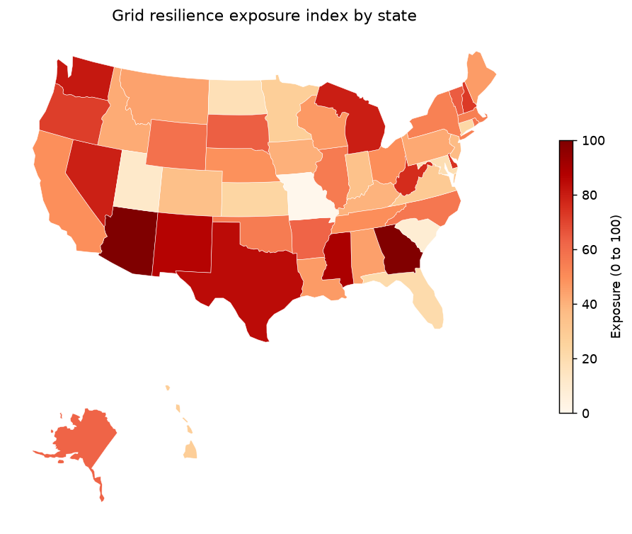

# Grid Resilience Exposure Index

A small, reproducible pipeline that scores U.S. states on how *exposed* or
*low-resilience* their electricity systems look, using only public data. It's
a research lens, not an operational tool — everything is state-level and built
from the same open sources that EIA, academics, and reporters already use.

## What it measures



*Example output. The committed results were generated from the synthetic
fallback sample (see below), so the ranking is illustrative — point it at the
live EIA API for real figures.*

The exposure index blends three components, each a proxy built from public
figures and oriented so that **higher = more exposed**:

| Component | Built from | Source |
|---|---|---|
| **Outage burden** | SAIDI / SAIFI reliability metrics | EIA-861 |
| **Infrastructure concentration** | Fuel-mix HHI + single-largest-plant share | EIA-860 |
| **Exposure deficit** | Capacity-to-peak-demand margin + fuel diversity | EIA-860 / -861 |

Each component is normalized (z-score by default), then combined with the
weights in `config.yaml`. The result is a 0–100 score and a ranking.

The weights are deliberate judgement calls — outage burden is weighted highest
because realized reliability is the most direct signal of resilience. They live
in one place (`config.yaml`) so the ranking's sensitivity to them is easy to
test.

## Data and the synthetic fallback

Live capacity data comes from the EIA open API (v2). To use it, get a free key
and export it:

```bash
export EIA_API_KEY=your_key_here      # Windows: setx EIA_API_KEY your_key
```

Without a key — or if a request fails — the pipeline drops to a **deterministic
synthetic sample** so it always runs end to end. Synthetic rows are tagged in a
`source` column and the run prints a reminder, so there's no confusing the two.
The EIA-861 reliability metrics ship as bulk workbooks rather than a clean API
route, so those currently use the synthetic path; `grid/sources.py` marks where
a real parser would go.

## Running it

```bash
pip install -r requirements.txt
python pipeline.py
```

Options:

```bash
python pipeline.py --normalize minmax --top-n 10
```

Outputs:

- `data/interim/state_table.csv` — cleaned, joined state table
- `outputs/exposure_index.csv` — ranked scores with component breakdown
- `outputs/ranked_states.png` — top-N bar chart
- `outputs/exposure_map.png` — choropleth (only if `geopandas` is installed)


## Layout

```
grid/
  sources.py    ingestion + synthetic fallbacks
  cleaning.py   plant rollups, joins, the state table
  scoring.py    components, normalization, composite
  plots.py      bar chart + optional map
pipeline.py     orchestrates the four steps
config.yaml     weights, source settings, output options
```

## Caveats

- State-level aggregation hides intra-state variation; a resilient state can
  still contain fragile pockets.
- HHI and top-plant share are coarse concentration proxies — they say nothing
  about transmission topology, which matters at least as much.
- Adapting to another region means swapping the source loaders and the region
  key; the cleaning and scoring steps are written against a generic `state`
  column and don't assume the U.S. otherwise.

## Data sources

- U.S. EIA Open Data (Forms 860, 861) — https://www.eia.gov/opendata/
- Natural Earth admin-1 boundaries (for the optional map) — public domain
