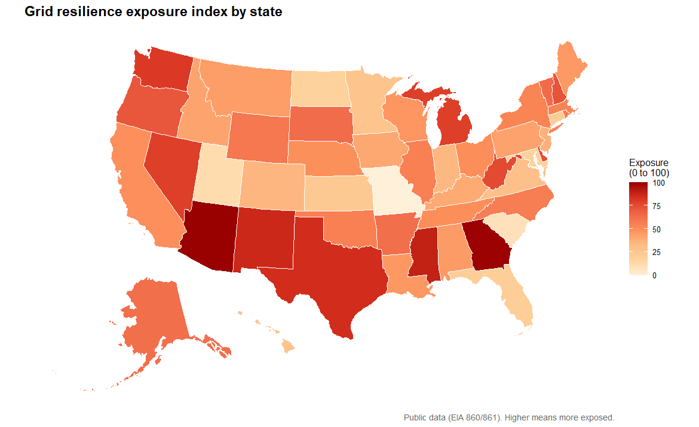
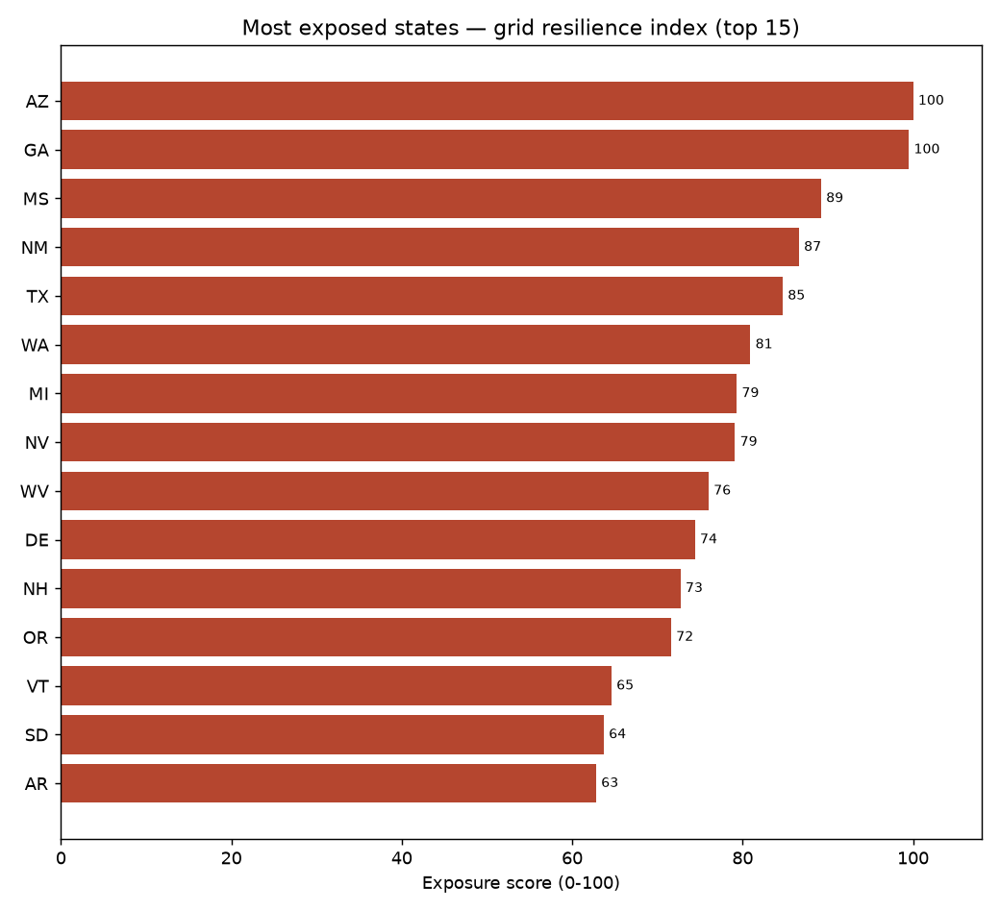
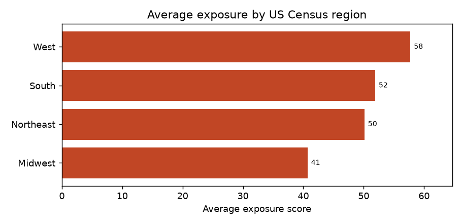

# Grid Resilience Exposure Index

This is a small data project I put together to look at which US states have the
most exposed or least resilient electricity systems, using only public data.
Everything here comes from open government sources, mostly the US Energy
Information Administration (EIA). It works at the state level, so it is meant as
a rough overview and not as anything precise or operational.



Note: the map above uses the built-in sample data, not a live download. So the
ranking is just an example of what comes out, not a real result. More on that
below.

## The short version

Every state gets one number, an "exposure score" from 0 to 100. A higher score
means the state looks more exposed, meaning more likely to have trouble keeping
the power on. The darker a state is on the map, the higher its score.

That single number is built from three simpler ideas, all taken from public
figures:

1. **Outage burden.** How often the power actually goes out, and for how long.
   The electricity industry tracks this with two standard measures called SAIDI
   and SAIFI. More and longer outages count as worse.

2. **Concentration.** How much of a state's power leans on one type of fuel, or
   on a single very large plant. If a lot depends on one thing, losing that one
   thing hurts more.

3. **Exposure deficit.** Whether a state has much spare generating capacity
   above its busiest demand, and whether its power supply is varied. Tight
   margins and little variety count as worse.

Each piece is put onto the same scale and then blended into the final score.
How much each piece counts is set in the `config.yaml` file, so you can change
the weights and run it again. I put the most weight on outage burden, because
how often the power really fails is the most direct evidence. The other two are
more about the underlying setup.

The scaling method also shifts the order a bit. Arizona and Georgia swap the top
spot depending on which one you use, so the exact ranking depends on a few
choices made in the settings.

## What you need to install

You do not have to be a programmer to run this, but you do need two free tools.
If you only want the analysis and the charts, you only need the first one.

**Python** (runs the main analysis):

1. Go to https://www.python.org/downloads and install Python 3.
2. On Windows, during the installer, tick the box that says
   "Add Python to PATH". This matters.
3. To check it worked, open a terminal (Command Prompt or PowerShell on
   Windows, Terminal on Mac) and type `python --version`. You should see a
   version number.

**R** (optional, only if you want to redraw the map yourself):

1. Go to https://cran.r-project.org and install R.
2. The map needs two R packages, usmap and ggplot2. Install them with the one
   line shown in step 3 below.

## How to run it

These steps assume you have opened a terminal and moved into the project folder.
If you are not sure how to move into the folder, the usual command is `cd`
followed by the path, for example `cd Downloads/energyosint`.

**Step 1. Install the Python add-ons the project uses.** This reads the list in
`requirements.txt` and installs everything in one go.

```
pip install -r requirements.txt
```

**Step 2. Run the analysis.**

```
python pipeline.py
```

That is the whole thing. It will print its progress, show the most exposed
states, and write its results into the `outputs` folder.

If you want to change a setting without editing files, there are two options you
can add:

```
python pipeline.py --normalize minmax --top-n 10
```

`--normalize` switches the scaling method, and `--top-n` sets how many states
show up in the bar chart.

**Step 3 (optional). Redraw the map in R.** If you installed R and want the R
version of the map, run this once to get the add-ons:

```
Rscript -e "install.packages(c('usmap','ggplot2'))"
```

Then draw the map:

```
Rscript analysis/exposure_map.R
```

## What you get

After running, look in the `outputs` folder:

- `exposure_index.csv` is the main result. Open it in Excel or Google Sheets.
  It has every state, its score, its rank, and the three pieces that went into
  the score.
- `ranked_states.png` is a bar chart of the most exposed states.
- `exposure_map.png` is the map drawn by Python.
- `exposure_map_r.png` is the map drawn by R (the one shown at the top).
- `exposure_states.gpkg` is the map data in a format you can open in free
  mapping software like QGIS, if you want to explore it as a real map layer.

The Python map and the GeoPackage need an extra library called geopandas. If you
want them, run `pip install geopandas` first. Without it the pipeline still runs
and just skips those two files (it prints a line saying so). The bar chart and
the results table do not need it.

There is also a `data` folder with the cleaned table and the raw inputs, in case
you want to see the numbers at each step.



## Data and the sample fallback

The real generation data comes from the EIA open data service. Using it needs a
free key. You request one at https://www.eia.gov/opendata, then save it where
the project can find it:

```
setx EIA_API_KEY your_key_here     # Windows
export EIA_API_KEY=your_key_here   # Mac or Linux
```

If there is no key, or the download fails, the project quietly switches to a
built-in sample so it still runs from start to finish. Sample rows are marked in
a `source` column, and the program says so when it finishes, so you can always
tell which one you got. If you would rather the run stop than fall back to sample
data, set `allow_synthetic_fallback: false` in `config.yaml`. The committed
results in this repo were made with the sample, which is why the ranking should
be read as an example.

The outage numbers (SAIDI and SAIFI) do not have a clean download endpoint like
the generation data, so for now they use the sample even when a key is set.
There is a note in the code marking where a real loader would go.

## How the project is laid out

```
grid/            the analysis code, split into small steps
  sources.py     gets the data (real or sample)
  cleaning.py    tidies it up and joins it together
  scoring.py     builds the three pieces and the final score
  plots.py       the bar chart and the Python map
pipeline.py      runs all the steps in order
analysis/
  exposure_map.R         the R version of the map
  weight_sensitivity.py  checks how much the weights move the ranking
  regional_summary.py    averages the scores up to US Census regions
docs/            a small web page version of this project
config.yaml      the weights and other settings
METHODOLOGY.md   the longer write-up of the choices and limits
```

## How much the weights matter

The weights are a judgement call, so `analysis/weight_sensitivity.py` re-scores
the states under a few different weightings and prints which ones stay in the top
10. On the sample data, six states (AZ, GA, MS, NM, TX, WA) land in the top 10 no
matter how the weights are set, while others move around a lot. West Virginia,
for instance, runs from 4th under an outage-heavy weighting to 23rd under a
structure-heavy one. So the very top of the table is fairly stable, but the
middle depends on the choices, which is worth keeping in mind when reading it.

The full reasoning behind the components, the weights, and the limitations is
written up in [METHODOLOGY.md](METHODOLOGY.md).

## A regional view

`analysis/regional_summary.py` averages the state scores up to the four US Census
regions, which is often an easier way to read the pattern. On the sample data the
West comes out highest, and the telling part is that each region is exposed for a
different reason: the West through tight capacity margins, the South through
actual outages, and the Northeast and Midwest through how concentrated their
supply is. It writes `outputs/regional_summary.csv` and the chart below.



## Sources

- EIA Open Data, Forms 860 and 861, https://www.eia.gov/opendata
- State map shapes: the R `usmap` package, and Natural Earth boundaries for the
  Python map

## Licence

MIT licence, see [LICENSE](LICENSE). Use it however you like.
