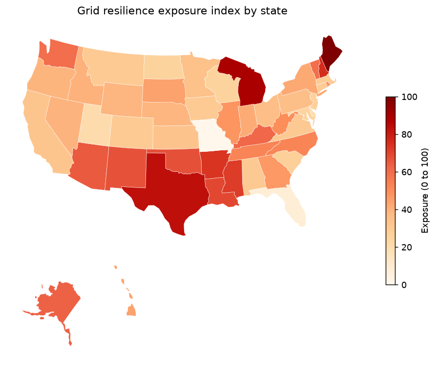
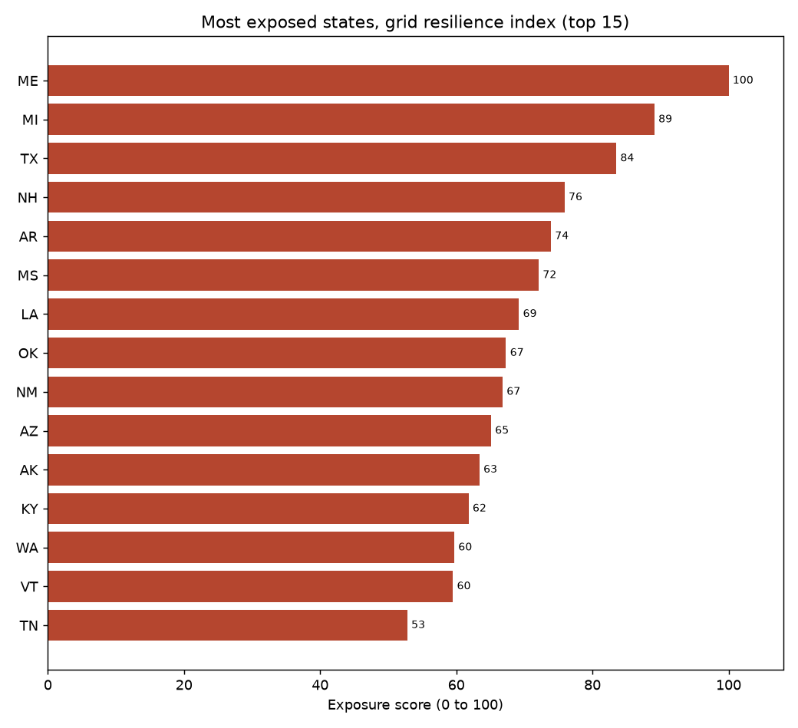
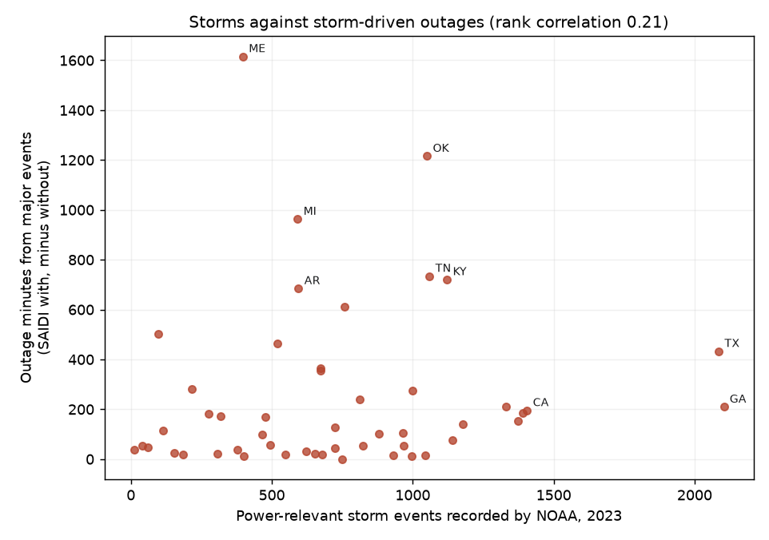
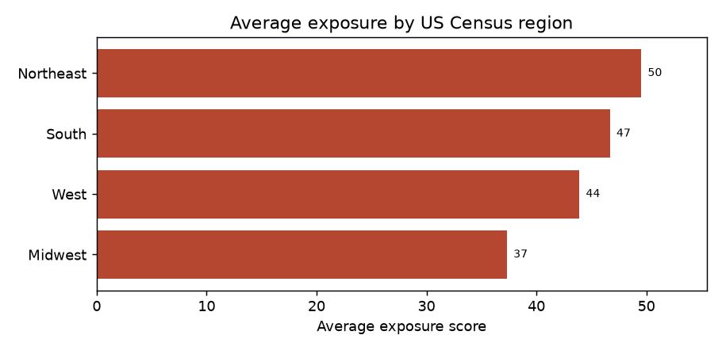

# Grid Resilience Exposure Index

[](https://github.com/tobyn-smith/energyosint/actions/workflows/build.yml)
[](LICENSE)

Which US states look most exposed to losing power, and what is driving it. Every
state gets one score from 0 to 100, built only from public government data.

**[Open the interactive deck](https://tobyn-smith.github.io/energyosint/)** ·
[Georgia deep dive](https://tobyn-smith.github.io/energyosint/georgia.html) ·
[Methodology](METHODOLOGY.md)

I am an international affairs student who codes, so this sits between the two:
the analysis is a proper pipeline, and the write-up is aimed at someone who has
to think about energy policy rather than wiring. It works at the state level, so
it is a broad lens rather than anything operational.



Note: the outage figures behind this are real (EIA-861, 2023). Capacity and peak
demand still come from a built-in sample, so the ranking is part worked example.
The pipeline prints which inputs were real on every run. More on that below.

## What it found

Four things stand out. The second is the one I would actually carry into a
policy conversation, and the last is the one I did not expect.

- **The top of the table is fairly stable.** Seven states (AR, LA, ME, MI, MS, NH,
  TX) stay in the top 10 under every weighting I tried. The middle moves a lot, so
  it should be read loosely. Maine is first by a distance: its customers averaged
  over thirty hours without power in 2023.
- **The same score means different things in different places.** The South scores
  high on actual outages, the West on thin capacity margins, and the Northeast and
  Midwest on how concentrated their supply is. That changes the policy lever:
  hardening lines is not the same job as adding capacity. Arizona has some of the
  best outage figures in the country and still lands tenth.
- **Two of the three parts overlap.** Concentration and the exposure deficit
  correlate at about 0.5, so the structural side is counted a little twice. That
  is a weakness of the index, and it is flagged rather than buried.
- **The weather story does not hold up as neatly as expected.** Checked against
  NOAA's storm records, how much damaging weather a state gets barely predicts how
  many outage minutes it loses to storms (rank correlation 0.21). Texas and Georgia
  log the most storm events in the country and lose few minutes; Maine logs a
  fraction as many and lost the most. See below.

## What is under the hood

- A Python pipeline (pandas, numpy) that ingests, cleans, scores and plots, with
  a seeded sample so it runs for anyone with no API key.
- Tests and a GitHub Action that reruns the pipeline and refreshes the site data
  on every change to the analysis code.
- Mapping in both languages: a Python choropleth via geopandas and an R map via
  `usmap`, plus a GeoPackage export that opens in QGIS.
- A SQLite store of every run, and an optional FastAPI service that re-ranks the
  states live for any set of weights using the same scoring code as the pipeline.
- A front end with no JavaScript libraries: the deck, the two interactive maps and
  the weight explorer are hand-written SVG and vanilla JS.

## The short version

Every state gets one number, an "exposure score" from 0 to 100. A higher score
means the state looks more exposed, meaning more likely to have trouble keeping
the power on. The darker a state is on the map, the higher its score.

That single number is built from three simpler ideas, all taken from public
figures:

1. **Outage burden.** How often the power actually goes out, and for how long.
   The electricity industry tracks this with two standard measures called SAIDI
   and SAIFI. More and longer outages count as worse.

2. **Concentration.** How much of a state's power leans on one type of fuel, or
   on a single very large plant. If a lot depends on one thing, losing that one
   thing hurts more.

3. **Exposure deficit.** Whether a state has much spare generating capacity
   above its busiest demand, and whether its power supply is varied. Tight
   margins and little variety count as worse.

Each piece is put onto the same scale and then blended into the final score.
How much each piece counts is set in the `config.yaml` file, so you can change
the weights and run it again. I put the most weight on outage burden, because
how often the power really fails is the most direct evidence. The other two are
more about the underlying setup.

The scaling method barely shifts the top of the table: z-score and min-max both
put Maine, Michigan and Texas in the first three. Further down it matters more,
so the exact position of a middling state depends on choices made in the settings.

The [project page](https://tobyn-smith.github.io/energyosint/) is an interactive
slide deck. If you would rather not click through it, the "read view" button in
the corner lays the same slides out as one continuous page, and printing does the
same thing. You can click through it with the arrow keys, the marks along the bottom,
or a swipe on your phone. The three weights are sliders on it, and moving them
re-ranks the table and re-shades the map live; you can also hover any state to see
its score and what is driving it. There is a separate, deeper dive on Georgia too.
It sets the score next to the state's real figures from the EIA, EPA and NOAA, and
has a map of every large power plant that you can filter by fuel.

Nothing in the scoring is US-specific, by the way. Given the same three inputs it
would run on any country's regions or provinces. It is written against the US
because the EIA publishes enough open data to build the whole thing from, which
few statistical agencies anywhere do.

## What you need to install

You do not have to be a programmer to run this, but you do need two free tools.
If you only want the analysis and the charts, you only need the first one.

**Python** (runs the main analysis):

1. Go to https://www.python.org/downloads and install Python 3.
2. On Windows, during the installer, tick the box that says
   "Add Python to PATH". This matters.
3. To check it worked, open a terminal (Command Prompt or PowerShell on
   Windows, Terminal on Mac) and type `python --version`. You should see a
   version number.

**R** (optional, only if you want to redraw the map yourself):

1. Go to https://cran.r-project.org and install R.
2. The map needs two R packages, usmap and ggplot2. Install them with the one
   line shown in step 3 below.

## How to run it

These steps assume you have opened a terminal and moved into the project folder.
If you are not sure how to move into the folder, the usual command is `cd`
followed by the path, for example `cd Downloads/energyosint`.

**Step 1. Install the Python add-ons the project uses.** This reads the list in
`requirements.txt` and installs everything in one go.

```
pip install -r requirements.txt
```

**Step 2. Run the analysis.**

```
python pipeline.py
```

That is the whole thing. It will print its progress, show the most exposed
states, and write its results into the `outputs` folder.

If you want to change a setting without editing files, there are two options you
can add:

```
python pipeline.py --normalize minmax --top-n 10
```

`--normalize` switches the scaling method, and `--top-n` sets how many states
show up in the bar chart.

**Step 3 (optional). Redraw the map in R.** If you installed R and want the R
version of the map, run this once to get the add-ons:

```
Rscript -e "install.packages(c('usmap','ggplot2'))"
```

Then draw the map:

```
Rscript analysis/exposure_map.R
```

The other scripts in `analysis/` (the weight, regional and overlap checks) read
what the pipeline writes, so run `python pipeline.py` before any of them.

## What you get

After running, look in the `outputs` folder:

- `exposure_index.csv` is the main result. Open it in Excel or Google Sheets.
  It has every state, its score, its rank, and the three pieces that went into
  the score.
- `ranked_states.png` is a bar chart of the most exposed states.
- `exposure_map.png` is the map drawn by Python (the one shown at the top).
- `exposure_map_r.png` is the same map drawn by R, if you have run the R script.
- `exposure_states.gpkg` is the map data in a format you can open in free
  mapping software like QGIS, if you want to explore it as a real map layer.

The Python map and the GeoPackage need an extra library called geopandas. If you
want them, run `pip install geopandas` first. Without it the pipeline still runs
and just skips those two files (it prints a line saying so). The bar chart and
the results table do not need it.

There is also a `data` folder with the cleaned table and the raw inputs, in case
you want to see the numbers at each step.



## Data and the sample fallback

The real generation data comes from the EIA open data service. Using it needs a
free key. You request one at https://www.eia.gov/opendata, then save it where
the project can find it:

```
setx EIA_API_KEY your_key_here     # Windows
export EIA_API_KEY=your_key_here   # Mac or Linux
```

If there is no key, or the download fails, the project quietly switches to a
built-in sample so it still runs from start to finish. Sample rows are marked in
a `source` column, and the program says so when it finishes, so you can always
tell which one you got. If you would rather the run stop than fall back to sample
data, set `allow_synthetic_fallback: false` in `config.yaml`.

Two of the inputs, the outage numbers (SAIDI and SAIFI) and state peak demand, do
not have a clean API endpoint the way the generation data does. EIA ships them as
bulk spreadsheets instead. Download the one you want and point `config.yaml` at it
(`reliability_workbook` and `demand_file`, either an absolute path or a file in
`data/raw`), and the pipeline reads it; if a file is missing it falls back to the
sample for that input alone. So a run can mix real and sample data, and it prints
exactly which it used:

```
[1/4] ingesting public data
      capacity: synthetic
      reliability: eia861
      demand: synthetic
```

The committed results were produced that way. The outage figures are the real
EIA-861 ones for 2023, from `f8612023.zip` on the
[EIA-861 page](https://www.eia.gov/electricity/data/eia861/). That file is not in
the repo, since it is EIA's to distribute and `data/raw` is ignored, so download it
yourself to reproduce the numbers exactly.

Reading it is fiddlier than it sounds, which is why there are tests for it. The
sheet has two stacked header rows, repeats the same column names under "IEEE
Standard" and again under "Any Standard", and writes missing values as ".". The
loader takes the IEEE figures including major event days, and uses the sheet EIA
has already aggregated to states rather than averaging utilities by hand, which
would count a small co-op the same as one serving millions.

## Does the outage data hold up?

The index leans hardest on outage burden, so `analysis/validate_outages.py` checks
it against a source collected by somebody else entirely: NOAA's Storm Events
Database, compiled by the National Weather Service.

The test is a sharp one. EIA publishes outage minutes twice, once counting major
storm days and once excluding them, so the difference is the part storms account
for. If the weather story is right, that gap should track how much damaging
weather a state actually had.

It mostly does not. Across the fifty places that report both figures (all but
Hawaii, which only publishes the one), the rank correlation is 0.21 against the
number of damaging storms and 0.24 against how much damage they did. Texas and
Georgia record the most power-relevant storm events in the country and lose few
minutes to them; Maine records a fraction as many and lost more than anyone.

Storms clearly matter, or the two outage figures would not be so far apart. But
how much bad weather arrives does not decide who suffers most, which points at how
the grid is built and how quickly crews restore it. That is an argument against
treating exposure as fate. It is one year of data and NOAA event counts partly
reflect how densely a state is observed, so I would not lean on it harder than
that, but it is a real result and it is reported as it came out.



## A JSON API

If you want the numbers as an API rather than files, there is a small optional
server. It reads whatever the pipeline last saved to the SQLite database and can
also re-rank the states live for any set of weights, using the same scoring code
the pipeline uses so the two never disagree.

```
pip install -r requirements-api.txt
python pipeline.py            # once, so there is a run to serve
uvicorn server:app --reload
```

Then open http://127.0.0.1:8000/docs for the interactive list, or call it directly:

- `GET /api/states` the full scored table, `/api/states/GA` for one state
- `GET /api/score?wO=60&wC=20&wD=20&top=10` re-ranks live for your own weights
- `GET /api/regions?level=region` or `division` rolls the scores up
- `GET /api/runs` and `GET /health` for what is stored

Every pipeline run is also saved to `outputs/index.db` (a SQLite file) and written
out to `docs/data/index.json`, which is what the web deck reads. A small GitHub
Action reruns the pipeline and refreshes that data file whenever the analysis code
changes.

## How the project is laid out

```
grid/            the analysis code, split into small steps
  sources.py     gets the data (real or sample)
  cleaning.py    tidies it up and joins it together
  scoring.py     builds the three pieces and the final score
  plots.py       the bar chart and the Python map
  store.py       saves each run to a small SQLite database
  regions.py     census region lookups and state names, shared around
pipeline.py      runs all the steps in order
server.py        an optional JSON API over the results (see below)
analysis/
  exposure_map.R         the R version of the map
  weight_sensitivity.py  checks how much the weights move the ranking
  regional_summary.py    averages the scores up to US Census regions
  component_overlap.py   checks whether the three parts overlap
  report.py              writes a short findings summary
  validate_outages.py    checks the outage data against NOAA storm records
  social_card.py         draws the link preview image for the site
docs/            the interactive slide deck and the Georgia deep dive
  data/index.json  the per-state data the deck reads, refreshed by the pipeline
  assets/og.png    the link preview image
config.yaml      the weights and other settings
requirements-api.txt  extra libraries for the API only
METHODOLOGY.md   the longer write-up of the choices and limits
.github/workflows/build.yml  rebuilds the site data on push
```

## How much the weights matter

The weights are a judgement call, so `analysis/weight_sensitivity.py` re-scores
the states under a few different weightings and prints which ones stay in the top
10. Seven states (AR, LA, ME, MI, MS, NH, TX) land in the top 10 no matter how the
weights are set, while others move around a lot. West Virginia, for instance, runs
from 13th under an outage-heavy weighting to 28th under a structure-heavy one. So
the very top of the table is fairly stable, but the middle depends on the choices,
which is worth keeping in mind when reading it.

The full reasoning behind the components, the weights, and the limitations is
written up in [METHODOLOGY.md](METHODOLOGY.md).

## A regional view

`analysis/regional_summary.py` averages the state scores up to the four US Census
regions, which is often an easier way to read the pattern. The Northeast and the
South come out highest, and the telling part is that each region gets there for a
different reason: the South through actual outages, the West through tight capacity
margins, and the Northeast and Midwest through how concentrated their supply is. It writes `outputs/regional_summary.csv` and the chart below. Run it
with `--level division` for the finer nine-way census split.



## Do the three parts overlap?

`analysis/component_overlap.py` checks how much the three components correlate,
since adding them up only makes sense if they are not all measuring the same
thing. Outage burden turns out to be its own signal, but concentration and the
exposure deficit move together (about 0.5 on the sample data): a state with a
concentrated supply also tends to have a tighter, less varied one. So the index
leans on that structural side of things a little twice, which is worth flagging
rather than hiding.

## Sources

- EIA Open Data, Forms 860 and 861, https://www.eia.gov/opendata
- State map shapes: the R `usmap` package, and Natural Earth boundaries for the
  Python map

## Licence

MIT licence, see [LICENSE](LICENSE). Use it however you like.
